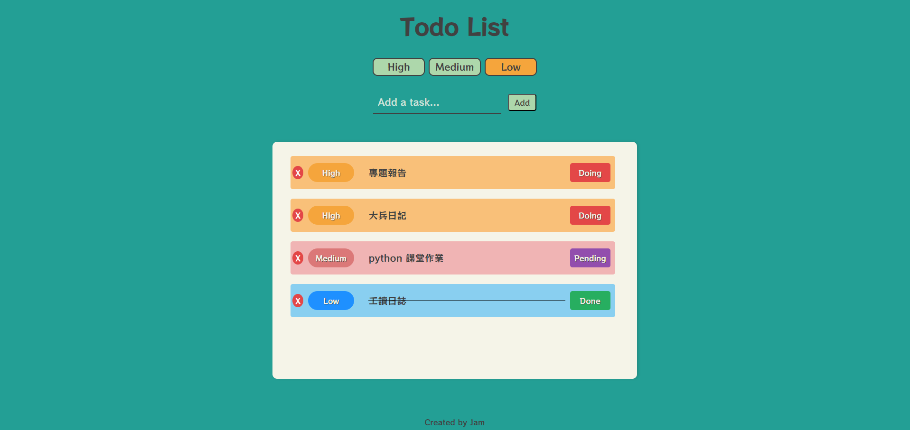

# ToDoList Application



## Setup

### Run the application
```python
pip install -r requirements.txt
python manage.py makemigrations
python manage.py migrate
python manage.py runserver
```

### Model Field Update
```python
python manage.py makemigrations
python manage.py migrate
```

### Create Superuser
```python
python manage.py createsuperuser
```